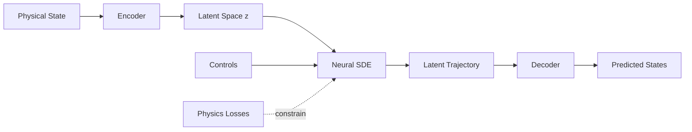

# 🏭 Digital Twin Engine

AI-powered digital twin for chemical process systems using physics-informed latent neural SDEs.

## What is this?

A fast, accurate, physics-informed simulator for chemical processes that:
- Runs **1000x faster** than first-principles simulation
- Provides **uncertainty quantification** via stochastic latent dynamics
- Enables **real-time model predictive control**
- Respects **conservation laws** (mass, energy)

## Architecture



### Core Components

1. **Encoder**: VAE-style encoder maps physical states [Ca, Cb, T, Tc] → latent space z ∈ ℝ¹⁶
2. **Latent Neural SDE**: Models dynamics in latent space: dz = f(z,u,c)dt + g(z,u,c)dW
3. **Decoder**: Maps latent states back to physical space with constraints
4. **Physics Losses**: Mass & energy conservation ensure physically-consistent predictions

**Total Parameters:** ~120K (optimized for RTX 4070)

## Installation

### Prerequisites
- Python ≥3.10, <3.15
- CUDA 12 (for GPU acceleration)
- 8GB+ GPU memory recommended

### Setup

```bash
# Clone repository
git clone <repo-url>
cd digital-twin-engine

# Create virtual environment
python3 -m venv .venv
source .venv/bin/activate  # On Windows: .venv\Scripts\activate

# Install package
pip install -e .
```

## Quick Start

### 1. Generate Training Data

```bash
python scripts/generate_data.py \
  --n_trajectories 10000 \
  --n_steps 1000 \
  --output_dir data/cstr/
```

This generates 10,000 diverse CSTR trajectories using:
- PRBS (Pseudo-Random Binary Sequence) signals
- Chirp signals with varying frequency
- Multi-step disturbances

**Output:** `data/cstr/train_data.h5` (~400MB)

### 2. Train the Digital Twin

```bash
python scripts/train.py \
  --config configs/training_default.yaml \
  --data_dir data/cstr/ \
  --output_dir outputs/cstr_v1/ \
  --n_epochs 100
```

Training includes:
- Reconstruction loss (trajectory matching)
- KL divergence (VAE regularization)
- Physics losses (mass & energy conservation)

**Output:** Trained model at `outputs/cstr_v1/best_model.eqx`

### 3. Evaluate Performance

```bash
python scripts/evaluate.py \
  --model_path outputs/cstr_v1/best_model.eqx \
  --config outputs/cstr_v1/config.yaml \
  --data_dir data/cstr/ \
  --output_dir outputs/cstr_v1/eval/
```

Generates:
- Trajectory comparison plots
- Prediction error analysis
- Conservation violation metrics
- Uncertainty calibration statistics

### 4. Run MPC Control

```bash
python scripts/run_mpc.py \
  --model_path outputs/cstr_v1/best_model.eqx \
  --model_config outputs/cstr_v1/config.yaml \
  --setpoint_T 340.0 \
  --compare_pid
```

Compares AI-MPC vs PID baseline on:
- Settling time
- Overshoot
- Integral Squared Error (ISE)
- Control effort

### 5. Launch Interactive Dashboard

```bash
streamlit run app/dashboard.py
```

Interactive demo with:
- Live simulation visualization
- Multiple control modes (Open Loop, PID, AI-MPC)
- Disturbance scenarios
- Performance metrics

## Project Structure

```
digital-twin-engine/
├── configs/              # Configuration files
│   ├── cstr_default.yaml
│   ├── training_default.yaml
│   └── mpc_default.yaml
├── dte/                  # Main package
│   ├── simulators/       # Physics simulators
│   ├── data/             # Data generation & loading
│   ├── models/           # Neural network models
│   ├── physics/          # Conservation laws
│   ├── control/          # MPC and PID controllers
│   ├── training/         # Training loops & losses
│   └── utils/            # Plotting & logging
├── scripts/              # Executable scripts
├── app/                  # Streamlit dashboard
├── tests/                # Unit tests
└── notebooks/            # Jupyter notebooks
```

## Technical Details

### CSTR Model

Non-isothermal continuous stirred-tank reactor with:
- Single first-order reaction: A → B
- State: [Ca, Cb, T, Tc] (concentrations, temperatures)
- Controls: [F_in, Tc_in] (flow rate, coolant temperature)
- Fully differentiable JAX implementation

### Neural Architecture

- **Encoder**: 3-layer MLP (128 hidden) → VAE latent distribution
- **Latent SDE**: Separate drift & diffusion networks
- **Decoder**: 3-layer MLP → constrained physical states
- **Training**: Adam optimizer with cosine decay + gradient clipping

### MPC Implementation

Sampling-based MPC using Cross-Entropy Method:
- 500 candidate trajectories per iteration
- 50 elite samples for refinement
- 3 CEM iterations
- Fully parallelized on GPU via `jax.vmap`

## Results

*Benchmark results will be added after full training on production dataset*

## Development

### Run Tests

```bash
pytest tests/ -v
```

### Generate Data (Small)

```bash
python scripts/generate_data.py --n_trajectories 100 --output_dir data/test/
```

### Train (Quick Test)

```bash
python scripts/train.py --data_dir data/test/ --n_epochs 5 --batch_size 8
```

## License

Proprietary. All rights reserved.
