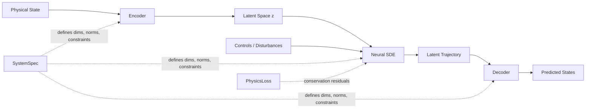

# Digital Twin Engine

AI-powered digital twin platform for industrial process systems using physics-informed latent neural SDEs.

## What is this?

A general-purpose surrogate modelling platform that:

- Runs **1000x faster** than first-principles simulation
- Provides **uncertainty quantification** via stochastic latent dynamics
- Enables **real-time model predictive control**
- Respects **conservation laws** (mass, energy) via physics-informed losses
- Works with **any process system** — not just CSTR (fully decoupled architecture)
- Adapts **online** to plant drift and new operating conditions
- Supports **transfer learning** across multiple units with few-shot fine-tuning
- Ships with a **REST API** and **Docker** deployment stack

## Architecture



### Core Components

1. **Encoder** — VAE-style encoder maps physical states + controls → latent space z
2. **Latent Neural SDE** — Models dynamics in latent space: `dz = f(z,u,c)dt + g(z,u,c)dW`
3. **Decoder** — Maps latent states back to physical space with configurable output constraints
4. **SystemSpec** — Dataclass that defines a system's dimensions, names, normalizations, and constraints
5. **PhysicsLoss** — Pluggable interface for system-specific conservation law residuals
6. **System Registry** — Instantiates any registered system by name from a YAML config
7. **Physics Registry** — Resolves system-specific physics losses and evaluation diagnostics

**Total Parameters:** ~120K (optimised for RTX 4070)

## Supported Systems

| System | States | Controls | Disturbances | Physics |
|---|---|---|---|---|
| `cstr` | 4 (Ca, Cb, T, Tc) | 2 (F_in, Tc_in) | 2 (Ca_in, T_in) | Mass + Energy balance |
| `heat_exchanger` | 2 (T_hot, T_cold) | 2 (F_hot, F_cold) | 2 (T_hot_in, T_cold_in) | Energy balance |

New systems require a YAML config, a simulator class, an optional physics loss, and registry entries — no changes to the core model or trainer.

## Installation

### Prerequisites
- Python ≥ 3.10, < 3.15
- CUDA 12 (for GPU acceleration; CPU works too)

### Setup

```bash
git clone <repo-url>
cd digital-twin-engine

python3 -m venv .venv
source .venv/bin/activate  # Windows: .venv\Scripts\activate

pip install -e .
```

## Quick Start

### 1. Generate Training Data

```bash
# CSTR (default)
python scripts/generate_data.py \
  --config configs/cstr_default.yaml \
  --n_trajectories 10000 \
  --output_dir data/cstr/

# Heat exchanger
python scripts/generate_data.py \
  --config configs/heat_exchanger_default.yaml \
  --n_trajectories 10000 \
  --output_dir data/heat_exchanger/
```

### 2. Ingest Real Plant Data

```bash
python scripts/ingest_real_data.py \
  --source data/raw/plant_run_01.csv \
  --output data/cstr_real/train_data.h5 \
  --system_config configs/cstr_default.yaml \
  --state_columns Ca Cb T Tc \
  --control_columns F_in Tc_in \
  --disturbance_columns Ca_in T_in \
  --timestamp_column time \
  --dt 0.1
```

Features: irregular timestamps, missing-value interpolation, outlier detection, sensor noise characterisation.

### 3. Train

```bash
python scripts/train.py \
  --config configs/training_default.yaml \
  --system_config configs/cstr_default.yaml \
  --data_dir data/cstr/ \
  --output_dir outputs/cstr_v1/ \
  --n_epochs 100
```

Training includes stochastic SDE path, curriculum learning, and teacher-forcing annealing (all configurable in `configs/training_default.yaml`).

### 4. Few-Shot Transfer Learning

```bash
# Fine-tune only the decoder on 5 new-unit trajectories
python scripts/train.py \
  --finetune outputs/cstr_v1/best_model.eqx \
  --finetune_part decoder \
  --data_dir data/cstr_unit2/ \
  --output_dir outputs/cstr_unit2/ \
  --n_epochs 10
```

### 5. Evaluate

```bash
python scripts/evaluate.py \
  --model_path outputs/cstr_v1/best_model.eqx \
  --config outputs/cstr_v1/config.yaml \
  --system_config configs/cstr_default.yaml \
  --data_dir data/cstr/ \
  --output_dir outputs/cstr_v1/eval/
```

### 6. Run MPC

```bash
python scripts/run_mpc.py \
  --model_path outputs/cstr_v1/best_model.eqx \
  --system_config configs/cstr_default.yaml \
  --setpoint_T 340.0 \
  --compare_pid
```

### 7. Deploy the REST API

```bash
# Local
uvicorn dte.api.service:app --host 0.0.0.0 --port 8000

# Docker
docker compose up api
```

Endpoints: `GET /health`, `POST /predict`, `POST /ensemble`, `POST /steady_state`.
Optional API-key auth: set `DTE_API_KEY` in the environment.

### 8. Launch the Dashboard

```bash
streamlit run app/dashboard.py
```

Optional password protection: set `STREAMLIT_AUTH_PASSWORD` in the environment.

### 9. Autoresearch Loop

```bash
python scripts/autoresearch.py \
  --config configs/autoresearch_default.yaml \
  --description baseline \
  --data_dir data/test/
```

## Project Structure

```
digital-twin-engine/
├── configs/
│   ├── cstr_default.yaml             # CSTR system spec + physics params
│   ├── heat_exchanger_default.yaml   # Heat exchanger system spec
│   ├── heat_exchanger_training.yaml  # HX-specific training hyper-params
│   ├── training_default.yaml         # Model + training configuration
│   └── mpc_default.yaml
├── dte/
│   ├── simulators/
│   │   ├── base.py           # SystemSpec, ProcessSimulator ABC
│   │   ├── registry.py       # System factory (get_system_spec, get_simulator)
│   │   ├── cstr.py           # CSTR simulator
│   │   └── heat_exchanger.py # Counter-current heat exchanger
│   ├── data/
│   │   ├── dataset.py        # TrajectoryDataset (HDF5 loader)
│   │   ├── generation.py     # CSTR-specific data generator
│   │   ├── generation_generic.py # Generic data generator (any ProcessSimulator)
│   │   └── real_data.py      # Real-world plant data ingestion pipeline
│   ├── models/
│   │   ├── encoder.py        # VAE encoder (SystemSpec-driven normalisation)
│   │   ├── latent_sde.py     # Drift + diffusion networks
│   │   ├── decoder.py        # Decoder with configurable output constraints
│   │   └── digital_twin.py   # Composed DigitalTwin module
│   ├── physics/
│   │   ├── base.py           # PhysicsLoss ABC + NullPhysicsLoss
│   │   ├── registry.py       # Physics loss / diagnostic registry
│   │   ├── cstr.py           # CSTR mass + energy balance residuals
│   │   └── heat_exchanger.py # Heat exchanger energy balance residual
│   ├── training/
│   │   ├── losses.py         # LossComputer (generic, pluggable PhysicsLoss)
│   │   ├── trainer.py        # Trainer with SDE training, curriculum, teacher-forcing
│   │   ├── online.py         # OnlineAdapter — sliding-window fine-tune + drift detection
│   │   └── transfer.py       # FewShotAdapter, zero_shot_eval, apply_finetune_mask
│   ├── api/
│   │   ├── models.py         # Pydantic request/response models
│   │   └── service.py        # FastAPI service
│   ├── control/              # MPC and PID controllers
│   ├── autoresearch/         # Autonomous research helpers
│   └── utils/                # Plotting, logging
├── scripts/
│   ├── generate_data.py      # Data generation (any registered system)
│   ├── ingest_real_data.py   # Real plant data ingestion CLI
│   ├── train.py              # Training (+ --finetune transfer-learning mode)
│   ├── evaluate.py
│   └── run_mpc.py
├── app/
│   ├── dashboard.py          # Streamlit dashboard (with optional auth)
│   └── agent_dashboard.py
├── Dockerfile                # Multi-stage: api + train targets
├── docker-compose.yml        # api + dashboard + optional tools profile
├── tests/
└── notebooks/
```

## Technical Details

### Training Improvements

| Feature | Config key | Description |
|---|---|---|
| Stochastic SDE training | `sde_training.enabled` | Full SDE path with KL diffusion regularisation |
| Curriculum learning | `curriculum.enabled` | seq_len ramps from `initial_seq_len` to `final_seq_len` over `warmup_epochs` |
| Teacher-forcing annealing | `teacher_forcing.initial_ratio` | Shifts weight from one-step to free-rollout loss |

### Online Adaptation

```python
from dte.training.online import OnlineAdapter, OnlineAdapterConfig

adapter = OnlineAdapter(model, system_spec, OnlineAdapterConfig(
    window_size=500,      # ring buffer size
    finetune_every=50,    # gradient steps every N observations
    drift_threshold=3.0,  # CUSUM alarm threshold
))

for obs in plant_stream:
    result = adapter.push(obs.states, obs.controls, obs.disturbances, obs.t)
    if result["drift"]:
        print("Drift detected — model recalibrated")
    model = adapter.model
```

### Transfer Learning

```python
from dte.training.transfer import FewShotAdapter, zero_shot_eval

# Zero-shot baseline
metrics = zero_shot_eval(pretrained_model, new_unit_dataset)

# Decoder-only fine-tune on N trajectories
adapter = FewShotAdapter(pretrained_model, system_spec)
finetuned = adapter.finetune(new_unit_dataset, n_steps=200, part="decoder")
```

### REST API

```bash
# Deterministic rollout
curl -X POST http://localhost:8000/predict \
  -H "Content-Type: application/json" \
  -d '{"system":"cstr","initial_state":[0.8,0.5,325,320],
       "controls":[[55,300],[56,302],[55,298]],"dt":0.1}'

# Stochastic ensemble (uncertainty bands)
curl -X POST http://localhost:8000/ensemble \
  -d '{"system":"cstr","initial_state":[0.8,0.5,325,320],
       "controls":[[55,300]],"n_samples":50}'
```

### Docker

```bash
# API only
docker build --target api -t dte-api .
docker run -p 8000:8000 \
  -e DTE_MODEL_PATH=outputs/best_model.eqx \
  -v $(pwd)/outputs:/app/outputs \
  dte-api

# Full stack (API + dashboard)
docker compose up

# With training tools
docker compose --profile tools up generate_data train
```

## Development

```bash
# Run tests
pytest tests/ -v

# Quick pipeline smoke-test
python scripts/generate_data.py --n_trajectories 100 --output_dir data/test/
python scripts/train.py --data_dir data/test/ --n_epochs 5 --batch_size 8

# Add a new system (minimal steps):
# 1. Create dte/simulators/my_system.py  (subclass ProcessSimulator)
# 2. Create dte/physics/my_system.py     (subclass PhysicsLoss)
# 3. Create configs/my_system_default.yaml
# 4. Register spec/simulator builders in dte/simulators/registry.py
# 5. Register physics builders in dte/physics/registry.py (if needed)
```

## License

Proprietary. All rights reserved.
