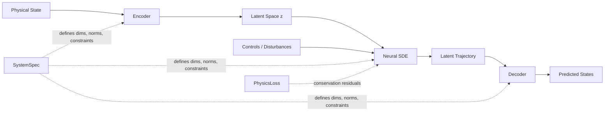

# Digital Twin Engine

Surrogate models of industrial process systems, built on physics-informed latent neural SDEs.

## What is this?

A research codebase for surrogate modelling of process systems with
physics-informed latent neural SDEs. It provides:

- **Uncertainty estimates** via stochastic latent dynamics, as ensemble spread
  over sampled rollouts. The variational element is a Gaussian encoder at
  t=0 (standard VAE KL). Diffusion magnitude is L2-regularised; there is no
  path-space posterior/prior KL.
- **Conservation-law residuals** (mass, energy) as physics-informed training
  losses and evaluation diagnostics for single-system training. Universal
  training uses bound/positivity penalties and law-based conditioning.
- **A decoupled system interface**, so a new process is added through a config,
  a simulator class, and registry entries rather than by editing the model
- **Few-shot transfer** across unit variants, including decoder-only
  fine-tuning on a handful of trajectories
- **A shared universal backbone**, training one checkpoint across several
  system types
- **An MPC loop, a REST API, and a Docker stack** for exercising trained models

### What this is not

This is a research codebase, not a validated engineering tool. Specifically:

- It has **not** been benchmarked against a commercial process simulator, and
  this repository makes no speedup claim. Any surrogate-versus-solver timing
  you need should be measured on your own hardware and workload.
- The MPC loop runs against the learned surrogate. It has never been connected
  to plant equipment, and nothing here should be treated as control-ready.
- Physics-informed losses penalise conservation residuals; they do not
  guarantee conservation.
- The latent dynamics are trained primarily as a point-prediction model with
  a Gaussian encoder at t=0 and an L2 penalty on diffusion magnitude. This is
  not a variational latent SDE with a Girsanov path-space KL.
- Rollouts condition on the true future disturbance trajectory. That is
  standard for simulation benchmarks and unavailable at plant deployment.
- The shipped systems are synthetic textbook processes. No real plant data is
  included or required.
- Online adaptation is implemented and exercised in tests, not validated
  against measured plant drift.

## Architecture



### Core Components

1. **Encoder** — VAE-style encoder maps physical states + controls → latent space z at the initial time
2. **Latent Neural SDE** — Models dynamics in latent space: `dz = f(z,u,c)dt + g(z,u,c)dW`. Stochastic training injects Euler–Maruyama noise; diffusion magnitude is L2-regularised.
3. **Decoder** — Maps latent states back to physical space with configurable output constraints
4. **SystemSpec** — Dataclass that defines a system's dimensions, names, normalizations, and constraints
5. **PhysicsLoss** — Pluggable interface for system-specific conservation law residuals
6. **System Registry** — Instantiates any registered system by name from a YAML config
7. **Physics Registry** — Resolves system-specific physics losses and evaluation diagnostics
8. **Universal Backbone** — Shared grouped-state model for one checkpoint across multiple systems

**Total Parameters:** ~120K

## Supported Systems

| System | States | Controls | Disturbances | Physics |
|---|---|---|---|---|
| `cstr` | 4 (Ca, Cb, T, Tc) | 2 (F_in, Tc_in) | 2 (Ca_in, T_in) | Mass + Energy balance |
| `heat_exchanger` | 2 (T_hot, T_cold) | 2 (F_hot, F_cold) | 2 (T_hot_in, T_cold_in) | Energy balance |
| `two_tank` | 2 (h1, h2) | 2 (q_in, valve) | 2 (d1, d2) | Mass balance |
| `isothermal_cstr` | 2 (Ca, Cb) | 1 (F_in) | 1 (Ca_in) | Species mass balance |
| `storage_tank` | 3 (inventory, quality, T) | 1 (outlet_flow) | 3 (feed rate/quality/T) | Inventory + energy |
| `separator` | 3 (light, heavy, T) | 1 (split_fraction) | 2 (feed quality/T) | Cut + energy residual |
| `bioreactor_compartment` | 3 (S, X, DO) | 1 (aeration) | 1 (feed_substrate) | Mass + oxygen residual |

New systems require a YAML config, a simulator class, an optional physics loss, and registry entries — no changes to the core model or trainer.

The shared universal path also uses typed state groups declared in each system config:
- `cstr`: concentration + thermal
- `heat_exchanger`: thermal
- `two_tank`: inventory

## Installation

### Prerequisites
- Python ≥ 3.10, < 3.15
- Node.js `^20.19.0 || >=22.12.0` for the Vite frontend (`.nvmrc` is pinned to Node 24)
- CUDA 12 (for GPU acceleration; CPU works too)

### Setup

```bash
git clone https://github.com/esmaeelMhd/digital-twin-engine.git
cd digital-twin-engine

python3 -m venv .venv
source .venv/bin/activate  # Windows: .venv\Scripts\activate

# CPU install: JAX, the model, training, evaluation, and MPC
pip install -e .

# GPU host: add the CUDA 12 JAX wheels
pip install -e ".[cuda]"
```

The base install is deliberately small. Everything beyond training and
evaluation is an opt-in extra, so a surrogate model does not drag in a web
server or three LLM SDKs:

| Extra | Adds | Needed for |
|---|---|---|
| `cuda` | CUDA 12 JAX wheels | GPU training |
| `api` | FastAPI, Uvicorn, httpx | the REST service in `dte/api` |
| `dashboard` | Streamlit, Plotly, scikit-learn | the apps in `app/`, latent-space plots |
| `autoresearch` | Anthropic, OpenAI, Google GenAI SDKs | the LLM loop in `scripts/agent.py` |
| `tracking` | Weights & Biases | experiment logging |
| `dev` | pytest, ruff, black (pulls `api`) | running the test suite |
| `all` | everything above except `cuda` | |

```bash
pip install -e ".[all]"      # everything
pip install -e ".[api]"      # just serve a trained model
```

## Quick Start

### 1. Generate Training Data

```bash
# CSTR (default)
python scripts/generate_data.py \
  --config configs/cstr_default.yaml \
  --n_trajectories 10000 \
  --output_dir data/cstr/

# Heat exchanger
python scripts/generate_data.py \
  --config configs/heat_exchanger_default.yaml \
  --n_trajectories 10000 \
  --output_dir data/heat_exchanger/

# Two-tank level process
python scripts/generate_data.py \
  --config configs/two_tank_default.yaml \
  --n_trajectories 10000 \
  --output_dir data/two_tank/
```

### 2. Ingest Real Plant Data

```bash
python scripts/ingest_real_data.py \
  --source data/raw/plant_run_01.csv \
  --output data/cstr_real/train_data.h5 \
  --system_config configs/cstr_default.yaml \
  --state_columns Ca Cb T Tc \
  --control_columns F_in Tc_in \
  --disturbance_columns Ca_in T_in \
  --timestamp_column time \
  --dt 0.1
```

Features: irregular timestamps, missing-value interpolation, outlier detection, sensor noise characterisation.

### 3. Train

```bash
python scripts/train.py \
  --config configs/training_default.yaml \
  --system_config configs/cstr_default.yaml \
  --data_dir data/cstr/ \
  --output_dir outputs/cstr_v1/ \
  --n_epochs 100
```

Training includes an optional stochastic SDE path, curriculum learning, and teacher-forcing annealing (all configurable in `configs/training_default.yaml`).

System-specific training configs are also included for simpler 2-state systems:
`configs/heat_exchanger_training.yaml` and `configs/two_tank_training.yaml`.

### 4. Train a Shared Universal Baseline

```bash
python scripts/train_universal.py \
  --config configs/training_universal.yaml \
  --output_dir outputs/universal_v1/ \
  --n_epochs 20 \
  --batch_size 128 \
  --seed 42
```

For a faster bounded baseline:

```bash
python scripts/train_universal.py \
  --config configs/training_universal_baseline_fast.yaml \
  --output_dir outputs/universal_fast_baseline/ \
  --seed 42
```

This trains one shared checkpoint across `cstr`, `heat_exchanger`, and `two_tank`
using:
- mixed-system padded batches
- typed state groups from the system configs
- a grouped universal backbone in `dte/models/universal/digital_twin.py`

Evaluate that shared checkpoint with:

```bash
python scripts/evaluate_universal.py \
  --model_path outputs/universal_v1/best_model.eqx \
  --config outputs/universal_v1/config.yaml \
  --output_dir outputs/universal_v1/eval/
```

### 5. Run the Canonical Unit-Foundation Baseline

```bash
python scripts/run_unit_foundation_baseline.py \
  --generation_config configs/generation_phase1_regime.yaml \
  --training_config configs/training_universal_phase1_regime.yaml \
  --workspace_dir outputs/unit_foundation_baseline/
```

This is the canonical convergence path:
- regime corpus generation
- universal unit-foundation training
- universal evaluation
- control-readiness gate on representative systems

### 6. Few-Shot Transfer Learning

```bash
# Fine-tune only the decoder on 5 new-unit trajectories
python scripts/train.py \
  --finetune outputs/cstr_v1/best_model.eqx \
  --finetune_part decoder \
  --data_dir data/cstr_unit2/ \
  --output_dir outputs/cstr_unit2/ \
  --n_epochs 10
```

### 7. Evaluate

```bash
python scripts/evaluate.py \
  --model_path outputs/cstr_v1/best_model.eqx \
  --config outputs/cstr_v1/config.yaml \
  --system_config configs/cstr_default.yaml \
  --data_dir data/cstr/ \
  --output_dir outputs/cstr_v1/eval/
```

For a held-out test set (fresh seed, never used for training or early stopping):

```bash
python scripts/generate_data.py \
  --config configs/cstr_default.yaml \
  --n_trajectories 500 \
  --output_dir data/cstr_test/ \
  --seed 12345

python scripts/evaluate.py \
  --model_path outputs/cstr_v1/best_model.eqx \
  --config outputs/cstr_v1/config.yaml \
  --system_config configs/cstr_default.yaml \
  --data_dir data/cstr/ \
  --test_data data/cstr_test/train_data.h5 \
  --output_dir outputs/cstr_v1/eval_test/
```

For the shared universal checkpoint:

```bash
python scripts/evaluate_universal.py \
  --model_path outputs/universal_v1/best_model.eqx \
  --config outputs/universal_v1/config.yaml \
  --output_dir outputs/universal_v1/eval/
```

### 8. Run MPC

```bash
python scripts/run_mpc.py \
  --model_path outputs/cstr_v1/best_model.eqx \
  --model_config outputs/cstr_v1/config.yaml \
  --system_config configs/cstr_default.yaml \
  --setpoint_T 340.0 \
  --compare_pid
```

### 9. Deploy the REST API

```bash
# Local
uvicorn dte.api.service:app --host 0.0.0.0 --port 8000

# Docker
docker compose up api
```

Endpoints: `GET /health`, `POST /predict`, `POST /ensemble`, `POST /steady_state`.
Optional API-key auth: set `DTE_API_KEY` in the environment.

`VITE_DTE_API_KEY` is a build-time Vite variable. Shipping it with the frontend
puts the key in the public JS bundle, so browser-side `X-API-Key` auth is
demo-only. For a real deployment, keep `DTE_API_KEY` on the API and do not bake
it into the frontend.

### 10. Launch the Dashboard

```bash
streamlit run app/dashboard.py
```

Optional password protection: set `STREAMLIT_AUTH_PASSWORD` in the environment.

### 11. Launch the React Frontend

```bash
nvm use
cd frontend
npm install
npm run dev
```

If `nvm` is not installed, upgrade Node manually to a supported release first. Node 18 is too old for the current Vite toolchain.

The browser frontend expects the API on `http://localhost:8000` by default.
Override that with `frontend/.env` if needed. `VITE_DTE_API_KEY` is optional and
demo-only: it is compiled into the public bundle, so it is not a production
secret.

### 12. Autoresearch Loop

```bash
python scripts/autoresearch.py \
  --config configs/autoresearch_default.yaml \
  --description baseline \
  --data_dir data/test/
```

## Project Structure

```
digital-twin-engine/
├── configs/                  # System specs, training, MPC, universal, autoresearch
├── dte/
│   ├── simulators/           # SystemSpec, registry, per-system simulators
│   ├── physics/              # PhysicsLoss ABC, registry, conservation residuals
│   ├── data/
│   │   ├── datasets/         # unit, universal, flowsheet HDF5 loaders
│   │   ├── generators/       # GenericDataGenerator for any ProcessSimulator
│   │   ├── generation.py     # CSTR-specific generator (legacy fast path)
│   │   └── ingestion/        # Real plant CSV/Parquet → HDF5
│   ├── models/
│   │   ├── unit/             # Encoder, Decoder, LatentSDE, DigitalTwin
│   │   ├── universal/        # Shared grouped-state universal backbone
│   │   └── flowsheet/        # Graph-composed flowsheet model
│   ├── training/
│   │   ├── shared/           # LossComputer, transfer, config resolution
│   │   ├── unit/             # Single-system trainer
│   │   ├── universal/        # Mixed-system trainer
│   │   ├── flowsheet/        # Flowsheet trainer
│   │   └── online.py         # Sliding-window fine-tune + CUSUM drift
│   ├── core/                 # ProcessUnitSpec, state schema
│   ├── laws/                 # Optional chemistry / thermo / biology modules
│   ├── flowsheet/            # Flowsheet schema and synthetic graphs
│   ├── calibration/          # Few-shot universal-unit calibration
│   ├── customer/             # Onboarding, template matching, reporting
│   ├── evaluation/           # Uncertainty, rollout, control metrics
│   ├── control/              # MPC, PID, RL env, state correction
│   ├── api/                  # FastAPI service
│   ├── demo/                 # Browser-demo engine
│   ├── convergence/          # Bounded experiment closure helpers
│   ├── autoresearch/         # Autonomous research helpers
│   └── utils/
├── scripts/                  # generate_data, train, evaluate, MPC, phases
├── app/                      # Streamlit dashboards
├── frontend/                 # React/Vite browser demo
├── tests/
├── Dockerfile
└── docker-compose.yml
```

## Technical Details

### Training Improvements

| Feature | Config key | Description |
|---|---|---|
| Stochastic SDE training | `sde_training.enabled` | Euler–Maruyama path plus L2 diffusion-magnitude regularisation |
| Curriculum learning | `curriculum.enabled` | seq_len ramps from `initial_seq_len` to `final_seq_len` over `warmup_epochs` |
| Teacher-forcing annealing | `teacher_forcing.initial_ratio` | Shifts weight from one-step to free-rollout loss |

### Online Adaptation

```python
from dte.training.online import OnlineAdapter, OnlineAdapterConfig

adapter = OnlineAdapter(model, system_spec, OnlineAdapterConfig(
    window_size=500,      # ring buffer size
    finetune_every=50,    # gradient steps every N observations
    drift_threshold=3.0,  # CUSUM alarm threshold
))

for obs in plant_stream:
    result = adapter.push(obs.states, obs.controls, obs.disturbances, obs.t)
    if result["drift"]:
        print("Drift detected — model recalibrated")
    model = adapter.model
```

### Transfer Learning

```python
from dte.training.shared.transfer import FewShotAdapter, zero_shot_eval

# Zero-shot baseline
metrics = zero_shot_eval(pretrained_model, new_unit_dataset)

# Decoder-only fine-tune on N trajectories
adapter = FewShotAdapter(pretrained_model, system_spec)
finetuned = adapter.finetune(new_unit_dataset, n_steps=200, part="decoder")
```

### REST API

```bash
# Deterministic rollout
curl -X POST http://localhost:8000/predict \
  -H "Content-Type: application/json" \
  -d '{"system":"cstr","initial_state":[0.8,0.5,325,320],
       "controls":[[55,300],[56,302],[55,298]],"dt":0.1}'

# Stochastic ensemble (uncertainty bands)
curl -X POST http://localhost:8000/ensemble \
  -d '{"system":"cstr","initial_state":[0.8,0.5,325,320],
       "controls":[[55,300]],"n_samples":50}'
```

### Docker

```bash
# API only
docker build --target api -t dte-api .
docker run -p 8000:8000 \
  -e DTE_MODEL_PATH=outputs/best_model.eqx \
  -v $(pwd)/outputs:/app/outputs \
  dte-api

# Full stack (API + frontend + dashboard)
docker compose up

# With training tools
docker compose --profile tools up generate_data train
```

## Development

```bash
# Run tests
pytest tests/ -v

# Quick pipeline smoke-test
python scripts/generate_data.py --n_trajectories 100 --output_dir data/test/
python scripts/train.py --data_dir data/test/ --n_epochs 5 --batch_size 8

# Add a new system (minimal steps):
# 1. Create dte/simulators/my_system.py  (subclass ProcessSimulator)
# 2. Create dte/physics/my_system.py     (subclass PhysicsLoss)
# 3. Create configs/my_system_default.yaml
# 4. Register spec/simulator builders in dte/simulators/registry.py
# 5. Register physics builders in dte/physics/registry.py (if needed)
```

## License

Apache License 2.0 — see [LICENSE](LICENSE) and [NOTICE](NOTICE).

Apache-2.0 rather than MIT because it carries an express patent grant, which matters for surrogate-modelling and process-control methods, and because the JAX stack this builds on (JAX, Equinox, Diffrax, Optax) is Apache-2.0 throughout.
