# Coding Agent Build Plan: `digital-twin-engine` v0.1

> **Goal:** A working MVP — latent Neural SDE for a CSTR, with physics losses, MPC control, and a Streamlit demo. Everything trainable on RTX 4070.

---

## Master Task Sequence

Feed these tasks to your coding agent **in order**. Each task is self-contained with exact file paths, specs, and verification.

---

## TASK 0: Repository Setup

### Prompt for agent:

```
Initialize the repo `digital-twin-engine` with the following structure and configuration files.

Create this exact directory structure (empty __init__.py files where needed):

digital-twin-engine/
├── README.md
├── pyproject.toml
├── .gitignore
├── .env.example
├── configs/
│   ├── cstr_default.yaml
│   ├── training_default.yaml
│   └── mpc_default.yaml
├── dte/
│   ├── __init__.py
│   ├── simulators/
│   │   ├── __init__.py
│   │   └── cstr.py
│   ├── data/
│   │   ├── __init__.py
│   │   ├── generation.py
│   │   └── dataset.py
│   ├── models/
│   │   ├── __init__.py
│   │   ├── encoder.py
│   │   ├── decoder.py
│   │   ├── latent_sde.py
│   │   └── digital_twin.py
│   ├── physics/
│   │   ├── __init__.py
│   │   ├── conservation.py
│   │   └── thermodynamics.py
│   ├── control/
│   │   ├── __init__.py
│   │   ├── mpc.py
│   │   └── pid.py
│   ├── training/
│   │   ├── __init__.py
│   │   ├── trainer.py
│   │   └── losses.py
│   └── utils/
│       ├── __init__.py
│       ├── logging.py
│       └── plotting.py
├── scripts/
│   ├── generate_data.py
│   ├── train.py
│   ├── evaluate.py
│   └── run_mpc.py
├── app/
│   └── dashboard.py
├── tests/
│   ├── test_simulator.py
│   ├── test_model.py
│   ├── test_physics.py
│   └── test_mpc.py
└── notebooks/
    └── 01_exploration.ipynb
```

For pyproject.toml use these dependencies:
- Python >=3.10,<3.13
- jax[cuda12]
- equinox
- diffrax
- optax
- jaxtyping
- pyyaml
- h5py
- numpy
- matplotlib
- streamlit
- plotly
- casadi
- do-mpc
- pytest
- tqdm
- wandb (optional)

Use hatch or pip as build system. Project name: "digital-twin-engine", version "0.1.0".

For .gitignore: standard Python + data/*.h5 + wandb/ + __pycache__ + .venv + *.egg-info + outputs/

For README.md: write a brief description:
"AI-powered digital twin engine for chemical process systems. Uses physics-constrained latent neural SDEs for fast simulation and model predictive control."

For .env.example:
WANDB_API_KEY=your_key_here
DATA_DIR=./data
OUTPUT_DIR=./outputs
```

**Verify:** `pip install -e .` succeeds. `python -c "import dte"` works.

---

## TASK 1: CSTR Simulator

### Prompt for agent:

```
Create file: dte/simulators/cstr.py

Implement a fully differentiable non-isothermal CSTR simulator using JAX and diffrax.

## Physics Model

Non-isothermal CSTR with single first-order reaction A → B and cooling jacket.

State vector: [Ca, Cb, T, Tc] where:
- Ca: concentration of reactant A (mol/L)
- Cb: concentration of product B (mol/L)  
- T: reactor temperature (K)
- Tc: coolant temperature (K)

Control inputs: [F_in, Tc_in] where:
- F_in: inlet flow rate (L/min)
- Tc_in: coolant inlet temperature (K)

Disturbances: [Ca_in, T_in] where:
- Ca_in: inlet concentration of A (mol/L)
- T_in: inlet temperature (K)

## ODEs (mass and energy balances):

dCa/dt = (F_in/V)*(Ca_in - Ca) - k(T)*Ca
dCb/dt = (F_in/V)*(0 - Cb) + k(T)*Ca
dT/dt  = (F_in/V)*(T_in - T) + (-dH_rxn/(rho*Cp))*k(T)*Ca + (UA/(V*rho*Cp))*(Tc - T)
dTc/dt = (Fc/Vc)*(Tc_in - Tc) + (UA/(Vc*rho_c*Cp_c))*(T - Tc)

where k(T) = k0 * exp(-Ea/(R*T))  (Arrhenius)

## Implementation Requirements:

1. Create a frozen dataclass `CSTRParams` with all parameters and sensible defaults:
   - V=100.0 (L), Vc=20.0 (L)
   - k0=7.2e10 (1/min), Ea_over_R=8750.0 (K) 
   - dH_rxn=-5e4 (J/mol), rho=1000.0 (g/L), Cp=0.239 (J/(g*K))
   - UA=5e4 (J/(min*K))
   - rho_c=1000.0 (g/L), Cp_c=4.18 (J/(g*K)), Fc=15.0 (L/min)

2. Create a class `CSTRSimulator` with methods:
   - __init__(self, params: CSTRParams)
   - dynamics(self, t, state, control, disturbance) -> state_dot
     (pure JAX function, vmappable and jittable)
   - simulate(self, initial_state, control_trajectory, disturbance_trajectory, 
              t_span, dt=0.1, n_steps=1000) -> dict with keys:
     {"time": array, "states": array, "controls": array}
     Use diffrax with Tsit5 solver.
   - steady_state(self, control, disturbance) -> state
     Find steady state by simulating for a long time.
   - get_conservation_quantities(self, states, controls, disturbances) -> dict
     Returns {"total_mass": array, "total_energy": array} at each timestep
     total_mass = Ca + Cb (should be conserved modulo flow in/out)

3. All methods must be JIT-compatible. Use jax.jit decorators where appropriate.

4. Create a helper function `sample_random_params(key, n=1)` that samples 
   CSTRParams with random variations:
   - V: uniform(50, 200)
   - k0: log-uniform(1e9, 1e12)  
   - UA: uniform(3e4, 8e4)
   - etc. (reasonable engineering ranges)

5. Add type hints throughout using jaxtyping: Float[Array, "..."]

## Config file: configs/cstr_default.yaml

cstr:
  V: 100.0
  Vc: 20.0
  k0: 7.2e10
  Ea_over_R: 8750.0
  dH_rxn: -50000.0
  rho: 1000.0
  Cp: 0.239
  UA: 50000.0
  rho_c: 1000.0
  Cp_c: 4.18
  Fc: 15.0

simulation:
  dt: 0.1
  t_span: [0.0, 100.0]
  
initial_conditions:
  Ca: 0.5
  Cb: 0.5
  T: 350.0
  Tc: 300.0

operating_ranges:
  F_in: [10.0, 100.0]
  Tc_in: [280.0, 320.0]
  Ca_in: [0.5, 2.0]
  T_in: [290.0, 350.0]
```

**Verify:** Create `tests/test_simulator.py`:
```
Test 1: Simulate 1000 steps from steady state with constant inputs. 
        Verify states stay at steady state (atol=1e-3).
Test 2: Simulate with step change in Tc_in. Verify T changes monotonically 
        in expected direction.
Test 3: Verify mass balance: integral of (flow_in*Ca_in - flow_out*Ca - reaction) ≈ dCa/dt*V
Test 4: vmap over 100 different initial conditions. Verify shapes are correct.
Test 5: jit compilation works without errors.
```

---

## TASK 2: Data Generation Pipeline

### Prompt for agent:

```
Create files: dte/data/generation.py and dte/data/dataset.py

## dte/data/generation.py

Build a data generation engine that creates diverse CSTR trajectories for training.

### Class: DataGenerator

__init__(self, simulator, config)

Methods:

1. generate_prbs_signal(key, n_steps, dt, min_val, max_val, switch_prob=0.05)
   -> array of shape (n_steps, 1)
   Pseudo-Random Binary Sequence: switches between min_val and max_val 
   with probability switch_prob at each step.

2. generate_chirp_signal(key, n_steps, dt, min_val, max_val, min_freq, max_freq)
   -> array of shape (n_steps, 1)
   Sinusoidal signal with linearly increasing frequency, scaled to [min_val, max_val].

3. generate_multistep_signal(key, n_steps, dt, min_val, max_val, n_changes=10)
   -> array of shape (n_steps, 1)
   Random step changes at random times.

4. generate_control_trajectory(key, n_steps, dt, operating_ranges, signal_type="mixed")
   -> array of shape (n_steps, n_controls)
   For each control input, randomly pick signal type (PRBS/chirp/multistep/constant)
   and generate accordingly. "mixed" randomly selects per-trajectory.

5. generate_disturbance_trajectory(key, n_steps, dt, operating_ranges)
   -> array of shape (n_steps, n_disturbances)
   Slower-varying signals (lower switch_prob) for disturbances.

6. generate_single_trajectory(key, params=None)
   -> dict {"time": (n_steps,), "states": (n_steps, 4), "controls": (n_steps, 2), 
            "disturbances": (n_steps, 2), "params": CSTRParams}
   If params is None, sample random params. 
   Sample random initial condition near steady state (add noise).
   Generate control + disturbance trajectories. Simulate.

7. generate_dataset(key, n_trajectories=10000, n_workers=1)
   -> dict of stacked arrays: 
   {"time": (N, n_steps), "states": (N, n_steps, 4), "controls": (N, n_steps, 2),
    "disturbances": (N, n_steps, 2), "params": (N, n_params)}
   Use jax.vmap where possible for speed. Show progress with tqdm.
   
8. save_dataset(dataset, path) - save as HDF5
9. load_dataset(path) -> dataset dict

### Important: 
- Normalize all data. Compute and store normalization statistics (mean, std) 
  for states, controls, disturbances.
- Save normalization stats alongside dataset.
- Add a small amount of Gaussian noise to states (simulating measurement noise):
  noise_std = 0.01 * state_range

## dte/data/dataset.py

Create a simple JAX-compatible dataset class:

class TrajectoryDataset:
    __init__(self, data_path_or_dict, seq_len=50, stride=10)
    
    - Loads data (or accepts dict)
    - Extracts subsequences of length seq_len with given stride
    - Properties: n_samples, state_dim, control_dim
    - __getitem__(self, idx) -> dict with keys:
      {"states": (seq_len, state_dim), "controls": (seq_len, control_dim), 
       "disturbances": (seq_len, dist_dim), "t": (seq_len,)}
    - sample_batch(self, key, batch_size) -> dict with same keys but leading batch dim
    - get_normalization_stats(self) -> dict {"state_mean", "state_std", "control_mean", ...}

## scripts/generate_data.py

Argparse script:
  --config configs/cstr_default.yaml
  --n_trajectories 10000  (default)
  --output_dir data/cstr/
  --seed 42

Generates dataset, saves to HDF5, prints summary statistics.
Should take ~10-30 minutes for 10K trajectories on CPU/GPU.
```

**Verify:**
```
Test 1: Generate 100 trajectories. Verify shapes.
Test 2: Verify normalization: normalized states have mean≈0, std≈1.
Test 3: Verify PRBS signal only takes values near min_val or max_val.
Test 4: Verify TrajectoryDataset.sample_batch returns correct shapes.
Test 5: Save and reload dataset. Verify equality.
```

---

## TASK 3: Model Architecture — Encoder & Decoder

### Prompt for agent:

```
Create files: dte/models/encoder.py and dte/models/decoder.py

Use Equinox (JAX neural network library) for all modules.

## dte/models/encoder.py

class Encoder(eqx.Module):
    """
    Encodes physical state [Ca, Cb, T, Tc] + system params 
    into latent space z ∈ R^latent_dim.
    
    Outputs both mean and log-variance (VAE-style) for stochastic encoding.
    """
    
    Architecture:
    - Input: state (4,) concatenated with normalized params (n_params,) 
      and current control (2,) = total input dim ~ 4 + n_params + 2
    - Hidden layers: 3x MLP with SiLU activation, hidden_dim=128
    - Output: two heads:
      - z_mean: Linear -> (latent_dim,)
      - z_logvar: Linear -> (latent_dim,)  
    - Method: encode(state, params, control) -> (z_mean, z_logvar)
    - Method: sample(z_mean, z_logvar, key) -> z  (reparameterization trick)
    - Method: __call__(state, params, control, key) -> (z, z_mean, z_logvar)
    
    Parameters:
    - state_dim: int = 4
    - param_dim: int = 6 (subset of CSTRParams that varies)
    - control_dim: int = 2
    - latent_dim: int = 16
    - hidden_dim: int = 128
    - n_layers: int = 3

## dte/models/decoder.py  

class Decoder(eqx.Module):
    """
    Decodes latent state z back to physical state [Ca, Cb, T, Tc].
    Also conditioned on params and control for better reconstruction.
    """
    
    Architecture:
    - Input: z (latent_dim,) concatenated with params (n_params,) and control (2,)
    - Hidden layers: 3x MLP with SiLU activation, hidden_dim=128
    - Output: reconstructed state (4,)
    - IMPORTANT: Apply output constraints:
      - Ca, Cb: softplus (must be non-negative)
      - T, Tc: 200 + 300*sigmoid (must be in ~200-500K range)
    - Method: __call__(z, params, control) -> reconstructed_state
    
    Parameters: same dims as encoder

## Key design notes:
- All modules must be pure Equinox modules (no side effects, JIT-compatible)
- Use jaxtyping for type annotations:
  from jaxtyping import Array, Float, PRNGKeyArray
- Weight initialization: use lecun_normal for hidden layers
- The encoder/decoder pair must be able to reconstruct states accurately 
  BEFORE we even add the latent dynamics (this is tested separately)
```

**Verify:**
```
Test 1: Encoder output shapes are correct: z_mean (batch, latent_dim), z_logvar (batch, latent_dim)
Test 2: Decoder output shapes: (batch, 4)
Test 3: Decoder outputs satisfy constraints (Ca>=0, Cb>=0, T in range)
Test 4: Full encode->decode roundtrip: random input -> encode -> decode -> output has correct shape
Test 5: Both modules are JIT-compatible: jax.jit(model)(inputs) works
Test 6: Parameter count is reasonable (~100K-500K total)
```

---

## TASK 4: Latent Neural SDE

### Prompt for agent:

```
Create file: dte/models/latent_sde.py

This is the CORE of the system. Implement a Neural SDE in latent space using diffrax.

## Class: LatentDrift(eqx.Module)
"""Drift function f(z, u, c) for the latent SDE: dz = f*dt + g*dW"""

Architecture:
- Input: z (latent_dim,) concatenated with control u (control_dim,) 
  and conditioning c (param_dim,)
- 3-layer MLP, hidden_dim=128, SiLU activation
- Output: (latent_dim,)
- OPTIONAL structure preservation: decompose output as
  f(z) = A(z)*z + B(z)*u + bias(z)
  where A is parameterized to have specific structure.
  For v0.1: just use plain MLP. Add structure later.

## Class: LatentDiffusion(eqx.Module)  
"""Diffusion function g(z, u, c) for the latent SDE"""

Architecture:
- Input: z (latent_dim,) concatenated with control u (control_dim,) 
  and conditioning c (param_dim,)
- 2-layer MLP, hidden_dim=64, SiLU activation
- Output: (latent_dim,) — DIAGONAL diffusion (one noise scale per latent dim)
- Apply softplus to output to ensure positive diffusion coefficients
- Scale output by a learnable scalar (initialized small, e.g., 0.1) 
  to start near deterministic

## Class: LatentSDE(eqx.Module)
"""Full latent SDE model combining drift and diffusion"""

Attributes:
- drift: LatentDrift
- diffusion: LatentDiffusion
- latent_dim: int
- control_dim: int
- param_dim: int

Methods:

1. __call__(self, ts, z0, controls, params, key) -> z_trajectory
   """
   Solve the SDE from z0 over timesteps ts, with given controls and params.
   
   Args:
     ts: (n_steps,) time points
     z0: (latent_dim,) initial latent state
     controls: (n_steps, control_dim) control inputs at each time
     params: (param_dim,) system parameters (conditioning)
     key: PRNG key for SDE noise
   
   Returns:
     z_traj: (n_steps, latent_dim) latent trajectory
   """
   
   Implementation:
   - Use diffrax.ControlTerm for the diffusion with 
     diffrax.VirtualBrownianTree for the Wiener process
   - Use diffrax.MultiTerm(ODETerm(drift_fn), ControlTerm(diffusion_fn, bm))
   - Solver: diffrax.EulerHeun() (good for SDEs) or diffrax.Heun()
   - The control input u(t) should be interpolated between timesteps
     using diffrax.LinearInterpolation over the controls array
   - dt0 = (ts[1] - ts[0]) / 2  (half the data timestep)
   - SaveAt(ts=ts)
   
   IMPORTANT: The drift and diffusion functions need to accept (t, z, args) 
   format for diffrax. Create wrapper closures that interpolate the control 
   signal at time t and pass params as conditioning.

2. sample_trajectories(self, ts, z0, controls, params, key, n_samples=10) -> z_trajectories
   """Sample multiple SDE paths. Returns (n_samples, n_steps, latent_dim)"""
   Use jax.vmap over different PRNG keys.

3. mean_trajectory(self, ts, z0, controls, params) -> z_trajectory  
   """Deterministic forward pass using only drift (set diffusion to 0).
   Returns (n_steps, latent_dim). Useful for MPC."""
   Use diffrax with just ODETerm(drift_fn), no noise.

## Config: Add to configs/training_default.yaml

model:
  latent_dim: 16
  hidden_dim: 128
  n_layers: 3
  drift_layers: 3
  diffusion_layers: 2
  diffusion_hidden_dim: 64
  initial_diffusion_scale: 0.1

sde:
  solver: "euler_heun"
  dt_ratio: 0.5  # dt0 = data_dt * dt_ratio
  
## CRITICAL implementation notes:
- diffrax expects specific function signatures. The drift wrapper should be:
  def drift_wrapper(t, z, args):
      control_at_t = control_interpolation.evaluate(t)
      return self.drift(z, control_at_t, params)
- For the diffusion with diagonal noise:
  def diffusion_wrapper(t, z, args):
      control_at_t = control_interpolation.evaluate(t)
      return jnp.diag(self.diffusion(z, control_at_t, params))
  This returns a (latent_dim, latent_dim) matrix for ControlTerm.
- Use diffrax.VirtualBrownianTree(t0, t1, tol=dt0/2, shape=(latent_dim,), key=key)
```

**Verify:**
```
Test 1: LatentSDE forward pass produces correct output shape (n_steps, latent_dim)
Test 2: sample_trajectories with n_samples=5 produces (5, n_steps, latent_dim)
Test 3: mean_trajectory is deterministic: two calls give same result
Test 4: sample_trajectories is stochastic: two calls with different keys give different results
Test 5: Gradients flow through the SDE solve: jax.grad of sum of output w.r.t. drift params works
Test 6: JIT compilation works
```

---

## TASK 5: Physics Losses

### Prompt for agent:

```
Create files: dte/physics/conservation.py and dte/training/losses.py

## dte/physics/conservation.py

Functions that compute conservation law violations in PHYSICAL space 
(after decoding from latent space).

1. mass_balance_residual(states, controls, disturbances, params, dt)
   """
   Compute mass balance residual at each timestep.
   
   For CSTR: d(V*Ca)/dt = F_in*Ca_in - F_out*Ca - V*k(T)*Ca
             d(V*Cb)/dt = F_in*0    - F_out*Cb + V*k(T)*Ca
   Total moles: d(V*(Ca+Cb))/dt = F_in*Ca_in - F_out*(Ca+Cb)
   
   Residual = |d(Ca+Cb)/dt - (F_in/V)*(Ca_in - Ca - Cb)|
   Approximate d/dt with finite differences.
   
   Returns: (n_steps-1,) array of residuals
   """

2. energy_balance_residual(states, controls, disturbances, params, dt)
   """
   Compute energy balance residual.
   
   For CSTR: rho*Cp*V*dT/dt = F_in*rho*Cp*(T_in-T) + V*(-dH)*k(T)*Ca + UA*(Tc-T)
   
   Residual = |rho*Cp*V*dT/dt - RHS|
   
   Returns: (n_steps-1,) array of residuals
   """

3. total_conservation_metric(states, controls, disturbances, params, dt)
   """Returns dict with:
   - mass_residual_mean: float
   - mass_residual_max: float  
   - energy_residual_mean: float
   - energy_residual_max: float
   """

## dte/training/losses.py

All loss functions for training the full model.

class LossComputer:
    """Computes all loss terms for the digital twin model."""
    
    __init__(self, config, normalization_stats)
    
    Methods:

1. reconstruction_loss(predicted_states, true_states)
   """MSE in normalized state space. Returns scalar."""

2. kl_divergence_loss(z_mean, z_logvar)
   """Standard VAE KL divergence: -0.5 * sum(1 + logvar - mean^2 - exp(logvar))
   Returns scalar."""

3. physics_mass_loss(predicted_states, controls, disturbances, params, dt)
   """Mean mass balance residual. Denormalize states first!
   Returns scalar."""

4. physics_energy_loss(predicted_states, controls, disturbances, params, dt)
   """Mean energy balance residual. Denormalize states first!
   Returns scalar."""

5. trajectory_loss(predicted_trajectory, true_trajectory)
   """MSE over full trajectory in normalized space. 
   Weight later timesteps higher (linearly increasing weight from 1 to 2).
   This encourages accurate long-horizon prediction.
   Returns scalar."""

6. total_loss(self, model, batch, key) -> (total_loss, loss_dict)
   """
   Compute all losses for a batch.
   
   Steps:
   a. Encode initial state: z0 = encoder(batch["states"][:, 0, :], ...)
   b. Roll out latent SDE: z_traj = latent_sde(ts, z0, controls, params, key)
   c. Decode all timesteps: pred_states = vmap(decoder)(z_traj)
   d. Compute all loss terms
   e. Combine: total = w_recon * reconstruction + w_kl * kl + 
                        w_traj * trajectory + w_mass * mass + w_energy * energy
   
   Returns:
     total_loss: scalar (for gradient computation)
     loss_dict: {"total": ..., "reconstruction": ..., "kl": ..., 
                 "trajectory": ..., "mass": ..., "energy": ...}
   """

Loss weights (in config):
  w_recon: 1.0
  w_kl: 0.001  (start very small, anneal up)
  w_traj: 10.0  (most important)
  w_mass: 0.1
  w_energy: 0.1

## Config: Add to configs/training_default.yaml

loss_weights:
  reconstruction: 1.0
  kl: 0.001
  trajectory: 10.0
  mass_balance: 0.1
  energy_balance: 0.1

kl_annealing:
  start_weight: 0.0
  end_weight: 0.001
  anneal_steps: 5000
```

**Verify:**
```
Test 1: mass_balance_residual returns near-zero for ground-truth simulator trajectories
Test 2: energy_balance_residual returns near-zero for ground-truth trajectories 
Test 3: reconstruction_loss is zero when predicted == true
Test 4: kl_divergence_loss is zero when mean=0, logvar=0
Test 5: total_loss runs without error on a dummy batch and returns finite scalar
Test 6: jax.grad(total_loss) w.r.t. model parameters computes without error
```

---

## TASK 6: Full Digital Twin Model

### Prompt for agent:

```
Create file: dte/models/digital_twin.py

Compose encoder, decoder, and latent SDE into a single model.

class DigitalTwin(eqx.Module):
    encoder: Encoder
    decoder: Decoder  
    latent_sde: LatentSDE
    
    @classmethod
    def from_config(cls, config: dict) -> "DigitalTwin":
        """Create model from config dict."""
        # Initialize all submodules with config params
        ...
    
    def encode(self, state, params, control, key=None):
        """Encode physical state to latent. If key provided, sample; else return mean."""
        z_mean, z_logvar = self.encoder.encode(state, params, control)
        if key is not None:
            z = self.encoder.sample(z_mean, z_logvar, key)
        else:
            z = z_mean
        return z, z_mean, z_logvar
    
    def decode(self, z, params, control):
        """Decode latent state to physical state."""
        return self.decoder(z, params, control)
    
    def predict(self, initial_state, controls, disturbances, params, ts, key):
        """
        Full prediction pipeline:
        1. Encode initial state -> z0
        2. Roll out latent SDE -> z_trajectory  
        3. Decode all timesteps -> predicted_states
        
        Returns dict:
          states: (n_steps, state_dim) predicted physical states
          latent: (n_steps, latent_dim) latent trajectory
          z_mean: (latent_dim,) encoder mean
          z_logvar: (latent_dim,) encoder log-variance
        """
    
    def predict_ensemble(self, initial_state, controls, disturbances, params, ts, key, n_samples=20):
        """
        Sample n_samples trajectories from the SDE.
        Returns:
          states_mean: (n_steps, state_dim)
          states_std: (n_steps, state_dim)
          states_samples: (n_samples, n_steps, state_dim)
        """
        # vmap over different keys
    
    def save(self, path):
        """Save model using eqx.tree_serialise_leaves"""
    
    @classmethod
    def load(cls, path, config):
        """Load model using eqx.tree_deserialise_leaves"""

Make sure the model is fully compatible with jax.jit, jax.vmap, and jax.grad.
The total parameter count should be printed on initialization.
```

**Verify:**
```
Test 1: DigitalTwin.from_config(config) creates model without error
Test 2: predict() returns correct shapes
Test 3: predict_ensemble() returns mean/std/samples with correct shapes
Test 4: save and load roundtrip preserves predictions (same output)
Test 5: Total parameter count is ~200K-1M (reasonable for RTX 4070)
```

---

## TASK 7: Training Loop

### Prompt for agent:

```
Create files: dte/training/trainer.py and scripts/train.py

## dte/training/trainer.py

class Trainer:
    __init__(self, model, loss_computer, config, dataset)
    
    Attributes:
    - model: DigitalTwin (Equinox module)
    - optimizer: optax optimizer
    - opt_state: optimizer state
    - loss_computer: LossComputer
    - dataset: TrajectoryDataset
    - config: dict
    - step: int
    
    Setup optimizer:
    - Use optax.chain(
        optax.clip_by_global_norm(1.0),
        optax.adam(learning_rate=optax.warmup_cosine_decay_schedule(
            init_value=1e-5,
            peak_value=3e-4,
            warmup_steps=500,
            decay_steps=50000,
            end_value=1e-6
        ))
      )
    
    Methods:
    
    1. train_step(self, batch, key) -> (model, opt_state, loss_dict)
       """Single training step. Use eqx.filter_grad for Equinox-style gradient computation.
       
       @eqx.filter_jit
       def _train_step(model, opt_state, batch, key):
           (loss, loss_dict), grads = eqx.filter_value_and_grad(
               loss_fn, has_aux=True
           )(model, batch, key)
           updates, new_opt_state = optimizer.update(grads, opt_state, model)
           new_model = eqx.apply_updates(model, updates)
           return new_model, new_opt_state, loss_dict
       """
    
    2. train_epoch(self, key) -> dict of mean losses
       """Loop over dataset in batches. Return mean losses for epoch."""
    
    3. validate(self, val_dataset, key, n_batches=50) -> dict
       """Compute losses on validation set without gradients."""
    
    4. evaluate_rollout(self, val_dataset, key, n_samples=10) -> dict
       """
       Evaluate long-horizon rollout accuracy:
       - Take n_samples trajectories from val set
       - Predict full trajectory from initial state
       - Compute MSE at each timestep
       - Compute conservation violations
       - Return dict with per-timestep metrics
       """
    
    5. train(self, n_epochs=100) -> training_history
       """
       Full training loop:
       - For each epoch:
         a. Train epoch
         b. Validate every 5 epochs
         c. Evaluate rollout every 10 epochs
         d. Save best model (by validation loss)
         e. Print progress
         f. Log to wandb if configured
       - Save final model
       - Return history dict
       """

## scripts/train.py

Argparse script:
  --config configs/training_default.yaml
  --data_dir data/cstr/
  --output_dir outputs/cstr_v1/
  --n_epochs 100
  --batch_size 64
  --seed 42
  --wandb (flag, optional)

Steps:
1. Load config
2. Load dataset, split 80/20 train/val
3. Create model from config
4. Create trainer
5. Train
6. Save model + training history + config
7. Print final metrics

## Config: configs/training_default.yaml (add to existing)

training:
  n_epochs: 100
  batch_size: 64
  seq_len: 50
  stride: 10
  val_split: 0.2
  
optimizer:
  peak_lr: 3.0e-4
  warmup_steps: 500
  total_steps: 50000
  end_lr: 1.0e-6
  gradient_clip: 1.0

checkpointing:
  save_every: 10  # epochs
  save_best: true
  output_dir: outputs/
```

**Verify:**
```
Test 1: Single train_step runs and loss decreases compared to random init
Test 2: Train for 10 steps on tiny dataset (100 trajectories). Loss decreases.
Test 3: validate() returns loss dict with all expected keys
Test 4: evaluate_rollout() returns per-timestep MSE array
Test 5: Model save/load preserves optimizer state
```

---

## TASK 8: Plotting & Evaluation Utilities

### Prompt for agent:

```
Create file: dte/utils/plotting.py

Matplotlib-based plotting utilities for analysis and demos.

Functions:

1. plot_trajectory_comparison(true_states, pred_states, times, 
                              state_names=["Ca", "Cb", "T", "Tc"],
                              controls=None, control_names=["F_in", "Tc_in"],
                              save_path=None)
   """
   2-column figure:
   Left column: each state variable over time (true vs predicted)
   Right column: control inputs over time
   Include legend, axis labels, title.
   If pred_states has 3 dims (n_samples, n_steps, state_dim), plot mean ± 2*std 
   as shaded region.
   """

2. plot_training_history(history_dict, save_path=None)
   """
   Plot all loss components over training steps.
   Use subplots: total loss, trajectory loss, physics losses, KL loss.
   Log scale y-axis.
   """

3. plot_latent_space(z_trajectories, labels=None, method="pca", save_path=None)
   """
   Visualize latent trajectories using PCA or t-SNE projection to 2D.
   Color by label if provided.
   """

4. plot_conservation_violation(mass_residuals, energy_residuals, times, save_path=None)
   """
   Plot conservation law violations over time.
   Show both model predictions and ground truth (should be ~0).
   """

5. plot_mpc_results(states, controls, setpoints, times, save_path=None)
   """
   Plot MPC control results: states tracking setpoints, control actions.
   """

Create file: scripts/evaluate.py

Argparse script:
  --model_path outputs/cstr_v1/best_model.eqx
  --config outputs/cstr_v1/config.yaml
  --data_dir data/cstr/
  --output_dir outputs/cstr_v1/eval/
  --n_samples 20  (for ensemble prediction)

Steps:
1. Load model and validation data
2. Run evaluate_rollout on 20 random validation trajectories
3. Generate all plots (trajectory comparisons, conservation, latent space)
4. Print summary table of metrics:
   - 1-step MSE, 10-step MSE, 50-step MSE
   - Mass balance violation (mean, max)
   - Energy balance violation (mean, max)
   - Uncertainty calibration: % of true values within predicted ±2σ
5. Save everything to output_dir
```

---

## TASK 9: PID Baseline Controller

### Prompt for agent:

```
Create file: dte/control/pid.py

Implement a simple PID controller as a baseline to beat.

class PIDController:
    __init__(self, Kp, Ki, Kd, setpoint, output_limits=(None, None), dt=0.1)
    
    Methods:
    - reset(self)
    - step(self, measurement) -> control_action
      Standard PID with anti-windup (clamp integral term).
    
class CSTRPIDController:
    """Two PID loops for CSTR: one for temperature (manipulating Tc_in), 
    one for concentration (manipulating F_in)."""
    
    __init__(self, T_setpoint, Ca_setpoint, dt=0.1)
    
    Default tuning (reasonable starting point):
    - Temperature loop: Kp=5.0, Ki=0.1, Kd=0.5
    - Concentration loop: Kp=50.0, Ki=1.0, Kd=5.0
    
    Methods:
    - step(self, state) -> (F_in, Tc_in)
    - reset(self)
    - run_closed_loop(self, simulator, initial_state, disturbances, 
                      n_steps, dt) -> dict of trajectories
```

---

## TASK 10: MPC Controller Using Digital Twin

### Prompt for agent:

```
Create file: dte/control/mpc.py

Implement Model Predictive Control using the trained DigitalTwin as the prediction model.

## Approach: 
Use CasADi for the NLP optimization. Since the model is in JAX, we need to 
interface between JAX and CasADi. 

For v0.1, use a SIMPLER approach: 
**Sampling-based MPC (Cross-Entropy Method / Random Shooting)**
This avoids the JAX-CasADi interface problem entirely and works natively with JAX.

class SamplingMPC:
    """
    Model Predictive Control using random shooting / CEM with the digital twin.
    
    Fully JAX-native. No CasADi needed.
    """
    
    __init__(self, model: DigitalTwin, config: dict)
    
    Config params:
    - horizon: int = 20 (prediction horizon in steps)
    - n_candidates: int = 500 (number of random control trajectories to sample)
    - n_elite: int = 50 (top candidates for CEM refinement)
    - n_iterations: int = 3 (CEM iterations)
    - control_dim: int = 2
    - control_bounds: dict (min/max for each control)
    - state_weights: array (cost weights for state tracking)
    - control_weights: array (cost weights for control effort)
    - terminal_weight: float = 5.0 (extra weight on final state)
    
    Methods:
    
    1. compute_cost(self, predicted_states, control_sequence, setpoints)
       """
       Cost = sum_t [ (x_t - x_ref)^T Q (x_t - x_ref) + (u_t - u_prev)^T R (u_t - u_prev) ]
              + terminal_weight * (x_T - x_ref)^T Q (x_T - x_ref)
       Returns scalar cost.
       """
    
    2. solve(self, current_state, params, setpoints, key) -> optimal_control_sequence
       """
       Cross-Entropy Method:
       a. Initialize: mean = previous_solution shifted, std = initial_std
       b. For each CEM iteration:
          - Sample n_candidates control sequences from N(mean, std^2)
          - Clip to control bounds
          - For each candidate, rollout digital twin (mean trajectory, no SDE noise)
            Use jax.vmap for parallel rollout!
          - Compute cost for each candidate
          - Select top n_elite candidates
          - Update mean and std from elite set
       c. Return mean of final elite set
       
       CRITICAL: This entire function should be JIT-compiled.
       The vmap over n_candidates makes it fast on GPU.
       """
    
    3. step(self, current_state, params, setpoints, key) -> control_action
       """
       Solve MPC, return first control action from optimal sequence.
       Warm-start next call with shifted solution.
       """
    
    4. run_closed_loop(self, simulator, initial_state, disturbances, setpoints,
                       params, n_steps, dt, key) -> dict
       """
       Run closed-loop MPC simulation:
       For each step:
         a. Get current state from simulator
         b. Solve MPC for optimal control
         c. Apply first control action to simulator
         d. Step simulator forward
       
       Returns: {"states": ..., "controls": ..., "costs": ..., "solve_times": ...}
       """

## Config: configs/mpc_default.yaml

mpc:
  horizon: 20
  n_candidates: 500
  n_elite: 50
  n_iterations: 3
  initial_std: 0.3
  
  control_bounds:
    F_in: [10.0, 100.0]
    Tc_in: [280.0, 320.0]
  
  cost_weights:
    state: [0.0, 0.0, 10.0, 0.0]  # primarily track temperature
    control_effort: [0.01, 0.1]
    terminal: 5.0

## scripts/run_mpc.py

Argparse script:
  --model_path outputs/cstr_v1/best_model.eqx
  --config configs/mpc_default.yaml
  --setpoint_T 340.0
  --disturbance_scenario "step"  (step change in Ca_in at t=50)
  --n_steps 200
  --output_dir outputs/mpc_results/
  --compare_pid (flag)

Steps:
1. Load trained digital twin
2. Set up CSTR simulator (ground truth plant)
3. Run MPC closed-loop
4. If --compare_pid: also run PID closed-loop
5. Plot comparison
6. Print metrics: settling time, overshoot, ISE, control effort
```

**Verify:**
```
Test 1: SamplingMPC.solve returns control sequence of shape (horizon, control_dim)
Test 2: Controls are within bounds
Test 3: run_closed_loop completes 50 steps without error
Test 4: MPC tracks setpoint better than open-loop (lower ISE)
Test 5: MPC solve time is <500ms per step on RTX 4070
```

---

## TASK 11: Streamlit Dashboard

### Prompt for agent:

```
Create file: app/dashboard.py

Build an interactive Streamlit dashboard for demoing the digital twin.

## Layout:

Page title: "🏭 Digital Twin Engine — AI-Powered Process Control"

Sidebar:
- Model selection (dropdown, for now just "CSTR v1")
- Operating parameters:
  - V (slider, 50-200 L)
  - UA (slider, 3e4-8e4 J/min/K)
  - k0 (log slider)
- Setpoints:
  - Temperature setpoint (slider, 300-400 K)
  - Concentration setpoint (slider, 0.1-2.0 mol/L)
- Control mode: Radio buttons ["Open Loop", "PID", "AI-MPC"]
- Disturbance scenario: Radio ["None", "Step in Ca_in", "Step in T_in", "Random"]
- Simulation length (slider, 50-500 steps)
- "Run Simulation" button

Main area (tabs):

Tab 1: "Live Simulation"
  - Plotly interactive chart: 4 subplots for Ca, Cb, T, Tc over time
  - If AI-MPC: show predicted trajectory + uncertainty band
  - Below: control actions plot
  
Tab 2: "Digital Twin vs Reality"
  - Side-by-side: simulator (ground truth) vs digital twin prediction
  - Show error over time
  - Show conservation violation metrics
  
Tab 3: "Performance Comparison"
  - Table comparing PID vs MPC: settling time, overshoot, ISE, energy usage
  - Bar chart of key metrics
  
Tab 4: "Model Info"
  - Model architecture summary
  - Training metrics
  - Parameter count
  - Latent space visualization (PCA of trajectories)

## Implementation notes:
- Load the trained model at app startup using @st.cache_resource
- Run simulations in JAX (should be fast enough for interactive use)
- Use plotly for interactive charts
- Keep the UI clean and professional — this is your sales demo
- Add a footer: "Powered by Digital Twin Engine | Physics-Informed Latent Neural SDEs"
```

---

## TASK 12: Final Integration & README

### Prompt for agent:

```
Update README.md with comprehensive documentation:

# 🏭 Digital Twin Engine

AI-powered digital twin for chemical process systems.

## What is this?

A fast, accurate, physics-informed simulator for chemical processes that:
- Runs **1000x faster** than first-principles simulation
- Provides **uncertainty quantification** via stochastic latent dynamics
- Enables **real-time model predictive control**
- Respects **conservation laws** (mass, energy, momentum)

## Architecture

[Include mermaid diagram of the system]

## Quick Start

```bash
# Install
pip install -e .

# Generate training data
python scripts/generate_data.py --n_trajectories 10000

# Train model  
python scripts/train.py --config configs/training_default.yaml

# Evaluate
python scripts/evaluate.py --model_path outputs/cstr_v1/best_model.eqx

# Run MPC comparison
python scripts/run_mpc.py --compare_pid

# Launch dashboard
streamlit run app/dashboard.py
```

## Results

[Placeholder for benchmark results table and figures]

## License

Proprietary. All rights reserved.
[DO NOT use MIT or Apache — keep it proprietary!]
```

Also create a QUICK_START.md with the exact commands to reproduce everything 
from scratch (data generation through dashboard launch).
```

---

## Execution Summary

```mermaid
graph LR
    T0["Task 0<br/>Repo Setup<br/>⏱️ 30min"] --> T1["Task 1<br/>CSTR Simulator<br/>⏱️ 3hrs"]
    T1 --> T2["Task 2<br/>Data Generation<br/>⏱️ 3hrs"]
    T2 --> T3["Task 3<br/>Encoder/Decoder<br/>⏱️ 2hrs"]
    T3 --> T4["Task 4<br/>Latent SDE<br/>⏱️ 4hrs"]
    T4 --> T5["Task 5<br/>Physics Losses<br/>⏱️ 2hrs"]
    T5 --> T6["Task 6<br/>Digital Twin Model<br/>⏱️ 2hrs"]
    T6 --> T7["Task 7<br/>Training Loop<br/>⏱️ 3hrs"]
    T7 --> T8["Task 8<br/>Evaluation/Plotting<br/>⏱️ 2hrs"]
    T8 --> T9["Task 9<br/>PID Baseline<br/>⏱️ 1hr"]
    T9 --> T10["Task 10<br/>MPC Controller<br/>⏱️ 4hrs"]
    T10 --> T11["Task 11<br/>Dashboard<br/>⏱️ 3hrs"]
    T11 --> T12["Task 12<br/>Integration/Docs<br/>⏱️ 1hr"]
```



| Task | Estimated Agent Time | Cumulative |
|---|---|---|
| Task 0: Repo Setup | 30 min | 0.5 hr |
| Task 1: CSTR Simulator | 3 hrs | 3.5 hr |
| Task 2: Data Generation | 3 hrs | 6.5 hr |
| Task 3: Encoder/Decoder | 2 hrs | 8.5 hr |
| Task 4: Latent SDE | 4 hrs | 12.5 hr |
| Task 5: Physics Losses | 2 hrs | 14.5 hr |
| Task 6: Digital Twin Model | 2 hrs | 16.5 hr |
| Task 7: Training Loop | 3 hrs | 19.5 hr |
| Task 8: Eval & Plotting | 2 hrs | 21.5 hr |
| Task 9: PID Baseline | 1 hr | 22.5 hr |
| Task 10: MPC Controller | 4 hrs | 26.5 hr |
| Task 11: Dashboard | 3 hrs | 29.5 hr |
| Task 12: Integration | 1 hr | **30.5 hr** |

**Realistic total with debugging: 40–50 hours of agent time over ~1–2 weeks.**

> **Critical instruction to your agent:** After each task, run the verification tests BEFORE moving to the next task. Fix all failures. The tasks are sequential — each depends on the previous one working correctly.

